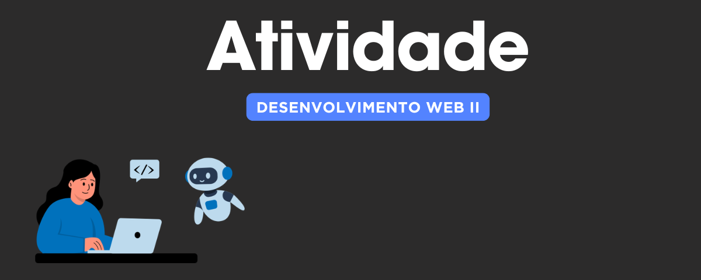
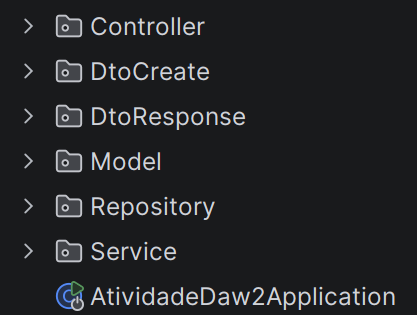

<h2>
Tecnologias e frameworks ultilizados
</h2>

Flyway - Para a  criação de tabelas do banco de dados 

SpringBoot - Para o mapeamento das requisições rest 

<h2>
Como está funcionando a atividade
</h2>

O projeto está organizado em pacotes cada um com sua responsabiliade

**Controller** : Responsável por receber as requisições do usuário a partir das rotas definidas
 
**DtoCreate e DtoResponse**: Responsáveis por gerenciar e filtrar os dados que é criado e mostrado pelo usuário para que não seja acessado os dados diretamente do banco
 
**Model**: Responsáveis por mapear os elementos das tabelas e transformar em objeto Java
 
**Repository**: Gerencias os dados do banco o que é criado e o que é retornado
 
**Service**: Define regras sobre como manipular os dados e o que pode ou não ser feito

